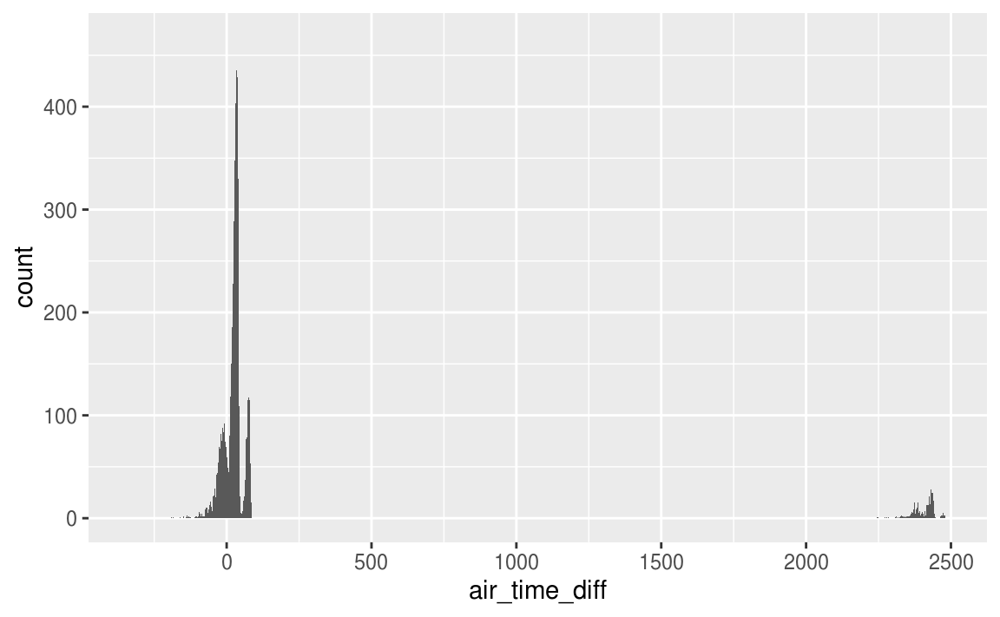

---
output: html_document
editor_options:
  chunk_output_type: console
---
# Data transformation

## Introduction


```r
library("nycflights13")
library("tidyverse")
```

## Filter rows with `filter()`

### Exercise <span class="exercise-number">5.2.1</span> {.unnumbered .exercise}

<div class="question">
Find all flights that

1.  Had an arrival delay of two or more hours
1.  Flew to Houston (IAH or HOU)
1.  Were operated by United, American, or Delta
1.  Departed in summer (July, August, and September)
1.  Arrived more than two hours late, but didn’t leave late
1.  Were delayed by at least an hour, but made up over 30 minutes in flight
1.  Departed between midnight and 6 am (inclusive)

</div>

<div class="answer">

The answer to each part follows.

1.  Since the `arr_delay` variable is measured in minutes, find
    flights with an arrival delay of 120 or more minutes.

    
    ```r
    filter(flights, arr_delay >= 120)
    #> # A tibble: 10,200 x 19
    #>    year month   day dep_time sched_dep_time dep_delay arr_time
    #>   <int> <int> <int>    <int>          <int>     <dbl>    <int>
    #> 1  2013     1     1      811            630       101     1047
    #> 2  2013     1     1      848           1835       853     1001
    #> 3  2013     1     1      957            733       144     1056
    #> 4  2013     1     1     1114            900       134     1447
    #> 5  2013     1     1     1505           1310       115     1638
    #> 6  2013     1     1     1525           1340       105     1831
    #> # … with 1.019e+04 more rows, and 12 more variables: sched_arr_time <int>,
    #> #   arr_delay <dbl>, carrier <chr>, flight <int>, tailnum <chr>,
    #> #   origin <chr>, dest <chr>, air_time <dbl>, distance <dbl>, hour <dbl>,
    #> #   minute <dbl>, time_hour <dttm>
    ```

1.  The flights that flew to Houston were are those flights where the 
    destination (`dest`) is either "IAH" or "HOU".
    
    ```r
    filter(flights, dest == "IAH" | dest == "HOU")
    #> # A tibble: 9,313 x 19
    #>    year month   day dep_time sched_dep_time dep_delay arr_time
    #>   <int> <int> <int>    <int>          <int>     <dbl>    <int>
    #> 1  2013     1     1      517            515         2      830
    #> 2  2013     1     1      533            529         4      850
    #> 3  2013     1     1      623            627        -4      933
    #> 4  2013     1     1      728            732        -4     1041
    #> 5  2013     1     1      739            739         0     1104
    #> 6  2013     1     1      908            908         0     1228
    #> # … with 9,307 more rows, and 12 more variables: sched_arr_time <int>,
    #> #   arr_delay <dbl>, carrier <chr>, flight <int>, tailnum <chr>,
    #> #   origin <chr>, dest <chr>, air_time <dbl>, distance <dbl>, hour <dbl>,
    #> #   minute <dbl>, time_hour <dttm>
    ```
    However, using `%in%` is more compact and would scale to cases where 
    there were more than two airports we were interested in.
    
    ```r
    filter(flights, dest %in% c("IAH", "HOU"))
    #> # A tibble: 9,313 x 19
    #>    year month   day dep_time sched_dep_time dep_delay arr_time
    #>   <int> <int> <int>    <int>          <int>     <dbl>    <int>
    #> 1  2013     1     1      517            515         2      830
    #> 2  2013     1     1      533            529         4      850
    #> 3  2013     1     1      623            627        -4      933
    #> 4  2013     1     1      728            732        -4     1041
    #> 5  2013     1     1      739            739         0     1104
    #> 6  2013     1     1      908            908         0     1228
    #> # … with 9,307 more rows, and 12 more variables: sched_arr_time <int>,
    #> #   arr_delay <dbl>, carrier <chr>, flight <int>, tailnum <chr>,
    #> #   origin <chr>, dest <chr>, air_time <dbl>, distance <dbl>, hour <dbl>,
    #> #   minute <dbl>, time_hour <dttm>
    ```
    

1.  In the `flights` dataset, the column `carrier` indicates the airline, but it uses two-character carrier codes.
    We can find the carrier codes for the airlines in the `airlines` dataset.
    Since the carrier code dataset only has 16 rows, and the names
    of the airlines in that dataset are not exactly "United", "American", or "Delta",
    it is easiest to manually look up their carrier codes in that data.

    
    ```r
    airlines
    #> # A tibble: 16 x 2
    #>   carrier name                    
    #>   <chr>   <chr>                   
    #> 1 9E      Endeavor Air Inc.       
    #> 2 AA      American Airlines Inc.  
    #> 3 AS      Alaska Airlines Inc.    
    #> 4 B6      JetBlue Airways         
    #> 5 DL      Delta Air Lines Inc.    
    #> 6 EV      ExpressJet Airlines Inc.
    #> # … with 10 more rows
    ```

    The carrier code for Delta is `"DL"`, for American is `"AA"`, and for United is `"UA"`.
    Using these carriers codes, we check whether `carrier` is one of those.

    
    ```r
    filter(flights, carrier %in% c("AA", "DL", "UA"))
    #> # A tibble: 139,504 x 19
    #>    year month   day dep_time sched_dep_time dep_delay arr_time
    #>   <int> <int> <int>    <int>          <int>     <dbl>    <int>
    #> 1  2013     1     1      517            515         2      830
    #> 2  2013     1     1      533            529         4      850
    #> 3  2013     1     1      542            540         2      923
    #> 4  2013     1     1      554            600        -6      812
    #> 5  2013     1     1      554            558        -4      740
    #> 6  2013     1     1      558            600        -2      753
    #> # … with 1.395e+05 more rows, and 12 more variables: sched_arr_time <int>,
    #> #   arr_delay <dbl>, carrier <chr>, flight <int>, tailnum <chr>,
    #> #   origin <chr>, dest <chr>, air_time <dbl>, distance <dbl>, hour <dbl>,
    #> #   minute <dbl>, time_hour <dttm>
    ```

1.  The variable `month` has the month, and it is numeric.
    So, the summer flights are those that departed in months 7 (July), 8 (August), and 9 (September).
    
    ```r
    filter(flights, month >= 7, month <= 9)
    #> # A tibble: 86,326 x 19
    #>    year month   day dep_time sched_dep_time dep_delay arr_time
    #>   <int> <int> <int>    <int>          <int>     <dbl>    <int>
    #> 1  2013     7     1        1           2029       212      236
    #> 2  2013     7     1        2           2359         3      344
    #> 3  2013     7     1       29           2245       104      151
    #> 4  2013     7     1       43           2130       193      322
    #> 5  2013     7     1       44           2150       174      300
    #> 6  2013     7     1       46           2051       235      304
    #> # … with 8.632e+04 more rows, and 12 more variables: sched_arr_time <int>,
    #> #   arr_delay <dbl>, carrier <chr>, flight <int>, tailnum <chr>,
    #> #   origin <chr>, dest <chr>, air_time <dbl>, distance <dbl>, hour <dbl>,
    #> #   minute <dbl>, time_hour <dttm>
    ```
    The `%in%` and `|` operators would also work, but using relational operators
    like `>=` and `<=` is preferred for numeric data. 
    
    ```r
    filter(flights, month %in% c(7, 8, 9))
    #> # A tibble: 86,326 x 19
    #>    year month   day dep_time sched_dep_time dep_delay arr_time
    #>   <int> <int> <int>    <int>          <int>     <dbl>    <int>
    #> 1  2013     7     1        1           2029       212      236
    #> 2  2013     7     1        2           2359         3      344
    #> 3  2013     7     1       29           2245       104      151
    #> 4  2013     7     1       43           2130       193      322
    #> 5  2013     7     1       44           2150       174      300
    #> 6  2013     7     1       46           2051       235      304
    #> # … with 8.632e+04 more rows, and 12 more variables: sched_arr_time <int>,
    #> #   arr_delay <dbl>, carrier <chr>, flight <int>, tailnum <chr>,
    #> #   origin <chr>, dest <chr>, air_time <dbl>, distance <dbl>, hour <dbl>,
    #> #   minute <dbl>, time_hour <dttm>
    ```

1.  Flights that arrived more than two hours late, but didn’t leave late will 
    have an arrival delay of more than 120 minutes (`dep_delay > 120`) and 
    a non-positive departure delay (`dep_delay <= 0`).
    
    ```r
    filter(flights, dep_delay <= 0, arr_delay > 120)
    #> # A tibble: 29 x 19
    #>    year month   day dep_time sched_dep_time dep_delay arr_time
    #>   <int> <int> <int>    <int>          <int>     <dbl>    <int>
    #> 1  2013     1    27     1419           1420        -1     1754
    #> 2  2013    10     7     1350           1350         0     1736
    #> 3  2013    10     7     1357           1359        -2     1858
    #> 4  2013    10    16      657            700        -3     1258
    #> 5  2013    11     1      658            700        -2     1329
    #> 6  2013     3    18     1844           1847        -3       39
    #> # … with 23 more rows, and 12 more variables: sched_arr_time <int>,
    #> #   arr_delay <dbl>, carrier <chr>, flight <int>, tailnum <chr>,
    #> #   origin <chr>, dest <chr>, air_time <dbl>, distance <dbl>, hour <dbl>,
    #> #   minute <dbl>, time_hour <dttm>
    ```

1.  Were delayed by at least an hour, but made up over 30 minutes in flight.
    If a flight was delayed by at least an hour, then `dep_delay >= 60`. 
    If the flight didn't make up any time in the air, then its arrival would be delayed by the same amount as its departure, meaning `dep_delay == arr_delay`, or alternatively, `dep_delay - arr_delay == 0`. 
    If it makes up over 30 minutes in the air, then the arrival delay must be at least 30 minutes less than the departure delay, which is stated as `dep_delay - arr_delay > 30`.
    
    ```r
    filter(flights, dep_delay >= 60, dep_delay - arr_delay > 30)
    #> # A tibble: 1,844 x 19
    #>    year month   day dep_time sched_dep_time dep_delay arr_time
    #>   <int> <int> <int>    <int>          <int>     <dbl>    <int>
    #> 1  2013     1     1     2205           1720       285       46
    #> 2  2013     1     1     2326           2130       116      131
    #> 3  2013     1     3     1503           1221       162     1803
    #> 4  2013     1     3     1839           1700        99     2056
    #> 5  2013     1     3     1850           1745        65     2148
    #> 6  2013     1     3     1941           1759       102     2246
    #> # … with 1,838 more rows, and 12 more variables: sched_arr_time <int>,
    #> #   arr_delay <dbl>, carrier <chr>, flight <int>, tailnum <chr>,
    #> #   origin <chr>, dest <chr>, air_time <dbl>, distance <dbl>, hour <dbl>,
    #> #   minute <dbl>, time_hour <dttm>
    ```

1.  Finding flights that departed between midnight and 6 am is complicated by 
    the way in which times are represented in the data. 
    In `dep_time`, midnight is represented by `2400`, not `0`.
    This means we cannot simply check that `dep_time < 600`, because we also have
    to consider the special case of midnight.
    
    
    ```r
    filter(flights, dep_time <= 600 | dep_time == 2400)
    #> # A tibble: 9,373 x 19
    #>    year month   day dep_time sched_dep_time dep_delay arr_time
    #>   <int> <int> <int>    <int>          <int>     <dbl>    <int>
    #> 1  2013     1     1      517            515         2      830
    #> 2  2013     1     1      533            529         4      850
    #> 3  2013     1     1      542            540         2      923
    #> 4  2013     1     1      544            545        -1     1004
    #> 5  2013     1     1      554            600        -6      812
    #> 6  2013     1     1      554            558        -4      740
    #> # … with 9,367 more rows, and 12 more variables: sched_arr_time <int>,
    #> #   arr_delay <dbl>, carrier <chr>, flight <int>, tailnum <chr>,
    #> #   origin <chr>, dest <chr>, air_time <dbl>, distance <dbl>, hour <dbl>,
    #> #   minute <dbl>, time_hour <dttm>
    ```

    Alternatively, we could use the [modulo operator](https://en.wikipedia.org/wiki/Modulo_operation), `%%`. 
    The modulo operator returns the remainder of division.
    Let's see how how this affects our times.
    
    ```r
    c(600, 1200, 2400) %% 2400
    #> [1]  600 1200    0
    ```

    Since `2400 %% 2400 == 0` and all other times are left unchanged, 
    we can compare the result of the modulo operation to `600`,

    
    ```r
    filter(flights, dep_time %% 2400 <= 600)
    #> # A tibble: 9,373 x 19
    #>    year month   day dep_time sched_dep_time dep_delay arr_time
    #>   <int> <int> <int>    <int>          <int>     <dbl>    <int>
    #> 1  2013     1     1      517            515         2      830
    #> 2  2013     1     1      533            529         4      850
    #> 3  2013     1     1      542            540         2      923
    #> 4  2013     1     1      544            545        -1     1004
    #> 5  2013     1     1      554            600        -6      812
    #> 6  2013     1     1      554            558        -4      740
    #> # … with 9,367 more rows, and 12 more variables: sched_arr_time <int>,
    #> #   arr_delay <dbl>, carrier <chr>, flight <int>, tailnum <chr>,
    #> #   origin <chr>, dest <chr>, air_time <dbl>, distance <dbl>, hour <dbl>,
    #> #   minute <dbl>, time_hour <dttm>
    ```

    This filter expression is more compact, but its readability will depends on the 
    familiarity of the reader with modular arithmetic.

</div>

### Exercise <span class="exercise-number">5.2.2</span> {.unnumbered .exercise}

<div class="question">
Another useful **dplyr** filtering helper is `between()`. What does it do? Can you use it to simplify the code needed to answer the previous challenges?
</div>

<div class="answer">

The expression `between(x, left, right)` is equivalent to `x >= left & x <= right`.

Of the answers in the previous question, we could simplify the statement of *departed in summer* (`month >= 7 & month <= 9`) using the `between()` function.

```r
filter(flights, between(month, 7, 9))
#> # A tibble: 86,326 x 19
#>    year month   day dep_time sched_dep_time dep_delay arr_time
#>   <int> <int> <int>    <int>          <int>     <dbl>    <int>
#> 1  2013     7     1        1           2029       212      236
#> 2  2013     7     1        2           2359         3      344
#> 3  2013     7     1       29           2245       104      151
#> 4  2013     7     1       43           2130       193      322
#> 5  2013     7     1       44           2150       174      300
#> 6  2013     7     1       46           2051       235      304
#> # … with 8.632e+04 more rows, and 12 more variables: sched_arr_time <int>,
#> #   arr_delay <dbl>, carrier <chr>, flight <int>, tailnum <chr>,
#> #   origin <chr>, dest <chr>, air_time <dbl>, distance <dbl>, hour <dbl>,
#> #   minute <dbl>, time_hour <dttm>
```

</div>

### Exercise <span class="exercise-number">5.2.3</span> {.unnumbered .exercise}

<div class="question">
How many flights have a missing `dep_time`? What other variables are missing? What might these rows represent?
</div>

<div class="answer">

Find the rows of flights with a missing departure time (`dep_time`) using the `is.na()` function.

```r
filter(flights, is.na(dep_time))
#> # A tibble: 8,255 x 19
#>    year month   day dep_time sched_dep_time dep_delay arr_time
#>   <int> <int> <int>    <int>          <int>     <dbl>    <int>
#> 1  2013     1     1       NA           1630        NA       NA
#> 2  2013     1     1       NA           1935        NA       NA
#> 3  2013     1     1       NA           1500        NA       NA
#> 4  2013     1     1       NA            600        NA       NA
#> 5  2013     1     2       NA           1540        NA       NA
#> 6  2013     1     2       NA           1620        NA       NA
#> # … with 8,249 more rows, and 12 more variables: sched_arr_time <int>,
#> #   arr_delay <dbl>, carrier <chr>, flight <int>, tailnum <chr>,
#> #   origin <chr>, dest <chr>, air_time <dbl>, distance <dbl>, hour <dbl>,
#> #   minute <dbl>, time_hour <dttm>
```

Notably, the arrival time (`arr_time`) is also missing for these rows. These
seem to be canceled flights.

</div>

### Exercise <span class="exercise-number">5.2.4</span> {.unnumbered .exercise}

<div class="question">
Why is `NA ^ 0` not missing? Why is `NA | TRUE` not missing?
Why is `FALSE & NA` not missing? Can you figure out the general rule?
(`NA * 0` is a tricky counterexample!)
</div>

<div class="answer">

`NA ^ 0 == 1` since for all numeric values $x ^ 0 = 1$.

```r
NA^0
#> [1] 1
```

`NA | TRUE` is `TRUE` because the value of the missing  `TRUE` or `FALSE`,
$x$ or `TRUE` is `TRUE` for all values of $x$.

```r
NA | TRUE
#> [1] TRUE
```
Likewise, anything and `FALSE` is always `FALSE`.

```r
NA & FALSE
#> [1] FALSE
```
Because the value of the missing element matters in `NA | FALSE` and `NA & TRUE`, these are missing:

```r
NA | FALSE
#> [1] NA
NA & TRUE
#> [1] NA
```

Since $x * 0 = 0$ for all finite, numeric $x$, we might expect `NA * 0 == 0`, but that's not the case.

```r
NA * 0
#> [1] NA
```
The reason that `NA * 0` is not equal to `0` is that $x \times \infty$ and $x \times -\infty$ is undefined.
R represents undefined results as `NaN`, which is an abbreviation of "[not a number](https://en.wikipedia.org/wiki/NaN)".

```r
Inf * 0
#> [1] NaN
-Inf * 0
#> [1] NaN
```

</div>

## Arrange rows with `arrange()`

### Exercise <span class="exercise-number">5.3.1</span> {.unnumbered .exercise}

<div class="question">
How could you use `arrange()` to sort all missing values to the start? (Hint: use `is.na()`).
</div>

<div class="answer">

We can put `NA` values first by sorting by both an indicator of whether the column has a missing value, and the column of interest. 
For example, to sort the data frame by departure time (`dep_time`) in ascending order, but place all missing values, run the following.

```r
arrange(flights, desc(is.na(dep_time)), dep_time)
#> # A tibble: 336,776 x 19
#>    year month   day dep_time sched_dep_time dep_delay arr_time
#>   <int> <int> <int>    <int>          <int>     <dbl>    <int>
#> 1  2013     1     1       NA           1630        NA       NA
#> 2  2013     1     1       NA           1935        NA       NA
#> 3  2013     1     1       NA           1500        NA       NA
#> 4  2013     1     1       NA            600        NA       NA
#> 5  2013     1     2       NA           1540        NA       NA
#> 6  2013     1     2       NA           1620        NA       NA
#> # … with 3.368e+05 more rows, and 12 more variables: sched_arr_time <int>,
#> #   arr_delay <dbl>, carrier <chr>, flight <int>, tailnum <chr>,
#> #   origin <chr>, dest <chr>, air_time <dbl>, distance <dbl>, hour <dbl>,
#> #   minute <dbl>, time_hour <dttm>
```

Otherwise, regardless of whether we use `desc()` or not, missing values will 
be placed at the end.

```r
arrange(flights, dep_time)
#> # A tibble: 336,776 x 19
#>    year month   day dep_time sched_dep_time dep_delay arr_time
#>   <int> <int> <int>    <int>          <int>     <dbl>    <int>
#> 1  2013     1    13        1           2249        72      108
#> 2  2013     1    31        1           2100       181      124
#> 3  2013    11    13        1           2359         2      442
#> 4  2013    12    16        1           2359         2      447
#> 5  2013    12    20        1           2359         2      430
#> 6  2013    12    26        1           2359         2      437
#> # … with 3.368e+05 more rows, and 12 more variables: sched_arr_time <int>,
#> #   arr_delay <dbl>, carrier <chr>, flight <int>, tailnum <chr>,
#> #   origin <chr>, dest <chr>, air_time <dbl>, distance <dbl>, hour <dbl>,
#> #   minute <dbl>, time_hour <dttm>
```

```r
arrange(flights, desc(dep_time))
#> # A tibble: 336,776 x 19
#>    year month   day dep_time sched_dep_time dep_delay arr_time
#>   <int> <int> <int>    <int>          <int>     <dbl>    <int>
#> 1  2013    10    30     2400           2359         1      327
#> 2  2013    11    27     2400           2359         1      515
#> 3  2013    12     5     2400           2359         1      427
#> 4  2013    12     9     2400           2359         1      432
#> 5  2013    12     9     2400           2250        70       59
#> 6  2013    12    13     2400           2359         1      432
#> # … with 3.368e+05 more rows, and 12 more variables: sched_arr_time <int>,
#> #   arr_delay <dbl>, carrier <chr>, flight <int>, tailnum <chr>,
#> #   origin <chr>, dest <chr>, air_time <dbl>, distance <dbl>, hour <dbl>,
#> #   minute <dbl>, time_hour <dttm>
```

</div>

### Exercise <span class="exercise-number">5.3.2</span> {.unnumbered .exercise}

<div class="question">
Sort flights to find the most delayed flights. Find the flights that left earliest.
</div>

<div class="answer">


Find the most delayed flights by sorting the table by departure delay, `dep_delay`, in descending order.

```r
arrange(flights, desc(dep_delay))
#> # A tibble: 336,776 x 19
#>    year month   day dep_time sched_dep_time dep_delay arr_time
#>   <int> <int> <int>    <int>          <int>     <dbl>    <int>
#> 1  2013     1     9      641            900      1301     1242
#> 2  2013     6    15     1432           1935      1137     1607
#> 3  2013     1    10     1121           1635      1126     1239
#> 4  2013     9    20     1139           1845      1014     1457
#> 5  2013     7    22      845           1600      1005     1044
#> 6  2013     4    10     1100           1900       960     1342
#> # … with 3.368e+05 more rows, and 12 more variables: sched_arr_time <int>,
#> #   arr_delay <dbl>, carrier <chr>, flight <int>, tailnum <chr>,
#> #   origin <chr>, dest <chr>, air_time <dbl>, distance <dbl>, hour <dbl>,
#> #   minute <dbl>, time_hour <dttm>
```
The most delayed flight was HA 51, JFK to HNL, which was scheduled to leave on January 09, 2013 09:00.
Note that the departure time is given as 641, which seems to be less than the scheduled departure time.
But the departure was delayed 1,301 minutes, which is 21 hours, 41 minutes.
The departure time is the day after the scheduled departure time.
Be happy that you weren't on that flight, and if you happened to have been on that flight and are reading this, I'm sorry for you.

Similarly, the earliest departing flight can be found by sorting `dep_delay` in ascending order.

```r
arrange(flights, dep_delay)
#> # A tibble: 336,776 x 19
#>    year month   day dep_time sched_dep_time dep_delay arr_time
#>   <int> <int> <int>    <int>          <int>     <dbl>    <int>
#> 1  2013    12     7     2040           2123       -43       40
#> 2  2013     2     3     2022           2055       -33     2240
#> 3  2013    11    10     1408           1440       -32     1549
#> 4  2013     1    11     1900           1930       -30     2233
#> 5  2013     1    29     1703           1730       -27     1947
#> 6  2013     8     9      729            755       -26     1002
#> # … with 3.368e+05 more rows, and 12 more variables: sched_arr_time <int>,
#> #   arr_delay <dbl>, carrier <chr>, flight <int>, tailnum <chr>,
#> #   origin <chr>, dest <chr>, air_time <dbl>, distance <dbl>, hour <dbl>,
#> #   minute <dbl>, time_hour <dttm>
```
Flight B6 97 (JFK to DEN) scheduled to depart on Saturday 07, 2013 at 21:23
departed 43 minutes early.

</div>

### Exercise <span class="exercise-number">5.3.3</span> {.unnumbered .exercise}

<div class="question">
Sort flights to find the fastest flights.
</div>

<div class="answer">

By "fastest" flights, I assume that the question refers to the flights with the 
shortest time in the air. 
Find these by sorting by `air_time`

```r
arrange(flights, air_time)
#> # A tibble: 336,776 x 19
#>    year month   day dep_time sched_dep_time dep_delay arr_time
#>   <int> <int> <int>    <int>          <int>     <dbl>    <int>
#> 1  2013     1    16     1355           1315        40     1442
#> 2  2013     4    13      537            527        10      622
#> 3  2013    12     6      922            851        31     1021
#> 4  2013     2     3     2153           2129        24     2247
#> 5  2013     2     5     1303           1315       -12     1342
#> 6  2013     2    12     2123           2130        -7     2211
#> # … with 3.368e+05 more rows, and 12 more variables: sched_arr_time <int>,
#> #   arr_delay <dbl>, carrier <chr>, flight <int>, tailnum <chr>,
#> #   origin <chr>, dest <chr>, air_time <dbl>, distance <dbl>, hour <dbl>,
#> #   minute <dbl>, time_hour <dttm>
```

However, "fastest" could also be interpreted as referring to the average air speed.
We can find these flights by sorting by the result of `distance / air_time / 60`, 
where the 60 is to convert the expression to miles per hour since `air_time` is in minutes.

```r
arrange(flights, distance / air_time * 60)
#> # A tibble: 336,776 x 19
#>    year month   day dep_time sched_dep_time dep_delay arr_time
#>   <int> <int> <int>    <int>          <int>     <dbl>    <int>
#> 1  2013     1    28     1917           1825        52     2118
#> 2  2013     6    29      755            800        -5     1035
#> 3  2013     8    28      932            940        -8     1116
#> 4  2013     1    30     1037            955        42     1221
#> 5  2013    11    27      556            600        -4      727
#> 6  2013     5    21      558            600        -2      721
#> # … with 3.368e+05 more rows, and 12 more variables: sched_arr_time <int>,
#> #   arr_delay <dbl>, carrier <chr>, flight <int>, tailnum <chr>,
#> #   origin <chr>, dest <chr>, air_time <dbl>, distance <dbl>, hour <dbl>,
#> #   minute <dbl>, time_hour <dttm>
```
This shows that we are not limited to sorting by columns in `arrange()`, but 
can sort by the results of arbitrary expressions, something which we had 
earlier seen with `desc()`.

</div>

### Exercise <span class="exercise-number">5.3.4</span> {.unnumbered .exercise}

<div class="question">

Which flights traveled the longest?
Which traveled the shortest?

</div>

<div class="answer">


To find the longest flight, sort the flights by the `distance` column in descending order.

```r
arrange(flights, desc(distance))
#> # A tibble: 336,776 x 19
#>    year month   day dep_time sched_dep_time dep_delay arr_time
#>   <int> <int> <int>    <int>          <int>     <dbl>    <int>
#> 1  2013     1     1      857            900        -3     1516
#> 2  2013     1     2      909            900         9     1525
#> 3  2013     1     3      914            900        14     1504
#> 4  2013     1     4      900            900         0     1516
#> 5  2013     1     5      858            900        -2     1519
#> 6  2013     1     6     1019            900        79     1558
#> # … with 3.368e+05 more rows, and 12 more variables: sched_arr_time <int>,
#> #   arr_delay <dbl>, carrier <chr>, flight <int>, tailnum <chr>,
#> #   origin <chr>, dest <chr>, air_time <dbl>, distance <dbl>, hour <dbl>,
#> #   minute <dbl>, time_hour <dttm>
```
The longest flight is HA 51, JFK to HNL, which is 4,983 miles.

To find the shortest flight, sort the flights by the `distance` in ascending order, which is the default sort order.

```r
arrange(flights, distance)
#> # A tibble: 336,776 x 19
#>    year month   day dep_time sched_dep_time dep_delay arr_time
#>   <int> <int> <int>    <int>          <int>     <dbl>    <int>
#> 1  2013     7    27       NA            106        NA       NA
#> 2  2013     1     3     2127           2129        -2     2222
#> 3  2013     1     4     1240           1200        40     1333
#> 4  2013     1     4     1829           1615       134     1937
#> 5  2013     1     4     2128           2129        -1     2218
#> 6  2013     1     5     1155           1200        -5     1241
#> # … with 3.368e+05 more rows, and 12 more variables: sched_arr_time <int>,
#> #   arr_delay <dbl>, carrier <chr>, flight <int>, tailnum <chr>,
#> #   origin <chr>, dest <chr>, air_time <dbl>, distance <dbl>, hour <dbl>,
#> #   minute <dbl>, time_hour <dttm>
```
The shortest flight is US 1632, EWR to LGA, which is only 17 miles.
This is a flight between two of the New York area airports.
However, since this flight is missing a departure time so it either did not actually fly or there is a problem with the data.

The terms "longest" and "shortest" could also refer to the time of the flight instead of the distance.
Now the longest and shortest flights by can be found by sorting by the `air_time` column.
The longest flights by airtime are the following.

```r
arrange(flights, desc(air_time))
#> # A tibble: 336,776 x 19
#>    year month   day dep_time sched_dep_time dep_delay arr_time
#>   <int> <int> <int>    <int>          <int>     <dbl>    <int>
#> 1  2013     3    17     1337           1335         2     1937
#> 2  2013     2     6      853            900        -7     1542
#> 3  2013     3    15     1001           1000         1     1551
#> 4  2013     3    17     1006           1000         6     1607
#> 5  2013     3    16     1001           1000         1     1544
#> 6  2013     2     5      900            900         0     1555
#> # … with 3.368e+05 more rows, and 12 more variables: sched_arr_time <int>,
#> #   arr_delay <dbl>, carrier <chr>, flight <int>, tailnum <chr>,
#> #   origin <chr>, dest <chr>, air_time <dbl>, distance <dbl>, hour <dbl>,
#> #   minute <dbl>, time_hour <dttm>
```
The shortest flights by airtime are the following.

```r
arrange(flights, air_time)
#> # A tibble: 336,776 x 19
#>    year month   day dep_time sched_dep_time dep_delay arr_time
#>   <int> <int> <int>    <int>          <int>     <dbl>    <int>
#> 1  2013     1    16     1355           1315        40     1442
#> 2  2013     4    13      537            527        10      622
#> 3  2013    12     6      922            851        31     1021
#> 4  2013     2     3     2153           2129        24     2247
#> 5  2013     2     5     1303           1315       -12     1342
#> 6  2013     2    12     2123           2130        -7     2211
#> # … with 3.368e+05 more rows, and 12 more variables: sched_arr_time <int>,
#> #   arr_delay <dbl>, carrier <chr>, flight <int>, tailnum <chr>,
#> #   origin <chr>, dest <chr>, air_time <dbl>, distance <dbl>, hour <dbl>,
#> #   minute <dbl>, time_hour <dttm>
```

</div>

## Select columns with `select()`

### Exercise <span class="exercise-number">5.4.1</span> {.unnumbered .exercise}

<div class="question">
Brainstorm as many ways as possible to select `dep_time`, `dep_delay`, `arr_time`, and `arr_delay` from flights.
</div>

<div class="answer">

These are a few ways to select columns.

-   Specify columns names as unquoted variable names.
    
    ```r
    select(flights, dep_time, dep_delay, arr_time, arr_delay)
    #> # A tibble: 336,776 x 4
    #>   dep_time dep_delay arr_time arr_delay
    #>      <int>     <dbl>    <int>     <dbl>
    #> 1      517         2      830        11
    #> 2      533         4      850        20
    #> 3      542         2      923        33
    #> 4      544        -1     1004       -18
    #> 5      554        -6      812       -25
    #> 6      554        -4      740        12
    #> # … with 3.368e+05 more rows
    ```

-   Specify column names as strings.
    
    ```r
    select(flights, "dep_time", "dep_delay", "arr_time", "arr_delay")
    #> # A tibble: 336,776 x 4
    #>   dep_time dep_delay arr_time arr_delay
    #>      <int>     <dbl>    <int>     <dbl>
    #> 1      517         2      830        11
    #> 2      533         4      850        20
    #> 3      542         2      923        33
    #> 4      544        -1     1004       -18
    #> 5      554        -6      812       -25
    #> 6      554        -4      740        12
    #> # … with 3.368e+05 more rows
    ```

-   Specify the column numbers of the variables.
    
    ```r
    select(flights, 4, 6, 7, 9)
    #> # A tibble: 336,776 x 4
    #>   dep_time dep_delay arr_time arr_delay
    #>      <int>     <dbl>    <int>     <dbl>
    #> 1      517         2      830        11
    #> 2      533         4      850        20
    #> 3      542         2      923        33
    #> 4      544        -1     1004       -18
    #> 5      554        -6      812       -25
    #> 6      554        -4      740        12
    #> # … with 3.368e+05 more rows
    ```
    This works, but is not good practice for two reasons.
    First, the column location of variables may change, resulting in code that 
    may continue to run without error, but produce the wrong answer. 
    Second code is obfuscated, since it is not clear from the code which 
    variables are being selected. What variable does column 6 correspond to? 
    I just wrote the code, and I've already forgotten.

-   Specify the names of the variables with character vector and `one_of()`.
    
    ```r
    select(flights, one_of(c("dep_time", "dep_delay", "arr_time", "arr_delay")))
    #> # A tibble: 336,776 x 4
    #>   dep_time dep_delay arr_time arr_delay
    #>      <int>     <dbl>    <int>     <dbl>
    #> 1      517         2      830        11
    #> 2      533         4      850        20
    #> 3      542         2      923        33
    #> 4      544        -1     1004       -18
    #> 5      554        -6      812       -25
    #> 6      554        -4      740        12
    #> # … with 3.368e+05 more rows
    ```
    This is useful because the names of the variables can be stored in a 
    variable and passed to `one_of()`.
    
    ```r
    variables <- c("dep_time", "dep_delay", "arr_time", "arr_delay")
    select(flights, one_of(variables))
    #> # A tibble: 336,776 x 4
    #>   dep_time dep_delay arr_time arr_delay
    #>      <int>     <dbl>    <int>     <dbl>
    #> 1      517         2      830        11
    #> 2      533         4      850        20
    #> 3      542         2      923        33
    #> 4      544        -1     1004       -18
    #> 5      554        -6      812       -25
    #> 6      554        -4      740        12
    #> # … with 3.368e+05 more rows
    ```

-   Selecting the variables by matching the start of their names using `starts_with()`.
    
    ```r
    select(flights, starts_with("dep_"), starts_with("arr_"))
    #> # A tibble: 336,776 x 4
    #>   dep_time dep_delay arr_time arr_delay
    #>      <int>     <dbl>    <int>     <dbl>
    #> 1      517         2      830        11
    #> 2      533         4      850        20
    #> 3      542         2      923        33
    #> 4      544        -1     1004       -18
    #> 5      554        -6      812       -25
    #> 6      554        -4      740        12
    #> # … with 3.368e+05 more rows
    ```

-   Selecting the variables using `matches()` and regular expressions, which are 
    discussed in the [Strings](http://r4ds.had.co.nz/strings.html) chapter.
    
    ```r
    select(flights, matches("^(dep|arr)_(time|delay)$"))
    #> # A tibble: 336,776 x 4
    #>   dep_time dep_delay arr_time arr_delay
    #>      <int>     <dbl>    <int>     <dbl>
    #> 1      517         2      830        11
    #> 2      533         4      850        20
    #> 3      542         2      923        33
    #> 4      544        -1     1004       -18
    #> 5      554        -6      812       -25
    #> 6      554        -4      740        12
    #> # … with 3.368e+05 more rows
    ```

Some things that **don't** work are

-   Matching the ends of their names using `ends_with()` since this will incorrectly
    include other variables. For example,
    
    ```r
    select(flights, ends_with("arr_time"), ends_with("dep_time"))
    #> # A tibble: 336,776 x 4
    #>   arr_time sched_arr_time dep_time sched_dep_time
    #>      <int>          <int>    <int>          <int>
    #> 1      830            819      517            515
    #> 2      850            830      533            529
    #> 3      923            850      542            540
    #> 4     1004           1022      544            545
    #> 5      812            837      554            600
    #> 6      740            728      554            558
    #> # … with 3.368e+05 more rows
    ```

-   Matching the names using `contains()` since there is not a pattern that can
    include all these variables without incorrectly including others.
    
    ```r
    select(flights, contains("_time"), contains("arr_"))
    #> # A tibble: 336,776 x 6
    #>   dep_time sched_dep_time arr_time sched_arr_time air_time arr_delay
    #>      <int>          <int>    <int>          <int>    <dbl>     <dbl>
    #> 1      517            515      830            819      227        11
    #> 2      533            529      850            830      227        20
    #> 3      542            540      923            850      160        33
    #> 4      544            545     1004           1022      183       -18
    #> 5      554            600      812            837      116       -25
    #> 6      554            558      740            728      150        12
    #> # … with 3.368e+05 more rows
    ```

</div>

### Exercise <span class="exercise-number">5.4.2</span> {.unnumbered .exercise}

<div class="question">
What happens if you include the name of a variable multiple times in a `select()` call?
</div>

<div class="answer">

The `select()` call ignores the duplication. Any duplicated variables are only included once, in the first location they appear. The `select()` function does not raise an error or warning or print any message if there are duplicated variables.

```r
select(flights, year, month, day, year, year)
#> # A tibble: 336,776 x 3
#>    year month   day
#>   <int> <int> <int>
#> 1  2013     1     1
#> 2  2013     1     1
#> 3  2013     1     1
#> 4  2013     1     1
#> 5  2013     1     1
#> 6  2013     1     1
#> # … with 3.368e+05 more rows
```

This behavior is useful because it means that we can use `select()` with `everything()` 
in order to easily change the order of columns without having to specify the names 
of all the columns.

```r
select(flights, arr_delay, everything())
#> # A tibble: 336,776 x 19
#>   arr_delay  year month   day dep_time sched_dep_time dep_delay arr_time
#>       <dbl> <int> <int> <int>    <int>          <int>     <dbl>    <int>
#> 1        11  2013     1     1      517            515         2      830
#> 2        20  2013     1     1      533            529         4      850
#> 3        33  2013     1     1      542            540         2      923
#> 4       -18  2013     1     1      544            545        -1     1004
#> 5       -25  2013     1     1      554            600        -6      812
#> 6        12  2013     1     1      554            558        -4      740
#> # … with 3.368e+05 more rows, and 11 more variables: sched_arr_time <int>,
#> #   carrier <chr>, flight <int>, tailnum <chr>, origin <chr>, dest <chr>,
#> #   air_time <dbl>, distance <dbl>, hour <dbl>, minute <dbl>,
#> #   time_hour <dttm>
```

</div>

### Exercise <span class="exercise-number">5.4.3</span> {.unnumbered .exercise}

<div class="question">
What does the `one_of()` function do? Why might it be helpful in conjunction with this vector?
</div>

<div class="answer">

The `one_of()` function selects variables with a character vector rather than unquoted variable name arguments.
This function is useful because it is easier to programmatically generate character vectors with variable names than to generate unquoted variable names, which are easier to type.


```r
vars <- c("year", "month", "day", "dep_delay", "arr_delay")
select(flights, one_of(vars))
#> # A tibble: 336,776 x 5
#>    year month   day dep_delay arr_delay
#>   <int> <int> <int>     <dbl>     <dbl>
#> 1  2013     1     1         2        11
#> 2  2013     1     1         4        20
#> 3  2013     1     1         2        33
#> 4  2013     1     1        -1       -18
#> 5  2013     1     1        -6       -25
#> 6  2013     1     1        -4        12
#> # … with 3.368e+05 more rows
```

</div>

### Exercise <span class="exercise-number">5.4.4</span> {.unnumbered .exercise}

<div class="question">
Does the result of running the following code surprise you? How do the select helpers deal with case by default? How can you change that default?
</div>

<div class="answer">


```r
select(flights, contains("TIME"))
#> # A tibble: 336,776 x 6
#>   dep_time sched_dep_time arr_time sched_arr_time air_time
#>      <int>          <int>    <int>          <int>    <dbl>
#> 1      517            515      830            819      227
#> 2      533            529      850            830      227
#> 3      542            540      923            850      160
#> 4      544            545     1004           1022      183
#> 5      554            600      812            837      116
#> 6      554            558      740            728      150
#> # … with 3.368e+05 more rows, and 1 more variable: time_hour <dttm>
```

The default behavior for `contains()` is to ignore case.
This may or may not surprise you.
If this behavior does not surprise you, that could be why it is the default.
Users searching for variable names probably have a better sense of the letters
in the variable than their capitalization.
A second, technical, reason is that dplyr works with more than R data frames.
It can also work with a variety of [databases](https://db.rstudio.com/dplyr/).
Some of these database engines have case insensitive column names, so making functions that match variable names
case insensitive by default will make the behavior of
`select()` consistent regardless of whether the table is
stored as an R data frame or in a database.

To change the behavior add the argument `ignore.case = FALSE`.


```r
select(flights, contains("TIME", ignore.case = FALSE))
#> # A tibble: 336,776 x 0
```

</div>

## Add new variables with `mutate()`

### Exercise <span class="exercise-number">5.5.1</span> {.unnumbered .exercise}

<div class="question">
Currently `dep_time` and `sched_dep_time` are convenient to look at, but hard to compute with because they’re not really continuous numbers. Convert them to a more convenient representation of number of minutes since midnight.
</div>

<div class="answer">

To get the departure times in the number of minutes, divide `dep_time` by 100 to get the hours since midnight and multiply by 60 and add the remainder of `dep_time` divided by 100.
For example, `1504` represents 15:04 (or 3:04 PM), which is 904 minutes after midnight.
To generalize this approach, we need a way to split out the hour-digits from the minute-digits.
Dividing by 100 and discarding the remainder using the integer division operator, `%/%` gives us the following.

```r
1504 %/% 100
#> [1] 15
```
Instead of `%/%` could also use `/` along with `trunc()` or `floor()`, but `round()` would not work.
To get the minutes, instead of discarding the remainder of the division by `100`,
we only want the remainder.
So we use the modulo operator, `%%`, discussed in the [Other Useful Functions](http://r4ds.had.co.nz/transform.html#select) section.

```r
1504 %% 100
#> [1] 4
```
Now, we can combine the hours (multiplied by 60 to convert them to minutes) and
minutes to get the number of minutes after midnight.

```r
1504 %/% 100 * 60 + 1504 %% 100
#> [1] 904
```

There is one remaining issue. Midnight is represented by `2400`, which would 
correspond to `1440` minutes since midnight, but it should correspond to `0`.
After converting all the times to minutes after midnight, `x %% 1440` will convert
`1440` to zero while keeping all the other times the same.

Now we will put it all together.
The following code creates a new data frame `flights_times` with columns `dep_time_mins` and `sched_dep_time_mins`.
These columns convert `dep_time` and `sched_dep_time`, respectively, to minutes since midnight.

```r
flights_times <- mutate(flights,
  dep_time_mins = (dep_time %/% 100 * 60 + dep_time %% 100) %% 1440,
  sched_dep_time_mins = (sched_dep_time %/% 100 * 60 +
    sched_dep_time %% 100) %% 1440
)
# view only relevant columns
select(
  flights_times, dep_time, dep_time_mins, sched_dep_time,
  sched_dep_time_mins
)
#> # A tibble: 336,776 x 4
#>   dep_time dep_time_mins sched_dep_time sched_dep_time_mins
#>      <int>         <dbl>          <int>               <dbl>
#> 1      517           317            515                 315
#> 2      533           333            529                 329
#> 3      542           342            540                 340
#> 4      544           344            545                 345
#> 5      554           354            600                 360
#> 6      554           354            558                 358
#> # … with 3.368e+05 more rows
```

Looking ahead to the [Functions](http://r4ds.had.co.nz/functions.html) chapter,
this is precisely the sort of situation in which it would make sense to write 
a function to avoid copying and pasting code.
We could define a function `time2mins()`, which converts a vector of times in
from the format used in `flights` to minutes since midnight.

```r
time2mins <- function(x) {
  (x %/% 100 * 60 + x %% 100) %% 1440
}
```
Using `time2mins`, the previous code simplifies to the following.

```r
flights_times <- mutate(flights,
  dep_time_mins = time2mins(dep_time),
  sched_dep_time_mins = time2mins(sched_dep_time)
)
# show only the relevant columns
select(
  flights_times, dep_time, dep_time_mins, sched_dep_time,
  sched_dep_time_mins
)
#> # A tibble: 336,776 x 4
#>   dep_time dep_time_mins sched_dep_time sched_dep_time_mins
#>      <int>         <dbl>          <int>               <dbl>
#> 1      517           317            515                 315
#> 2      533           333            529                 329
#> 3      542           342            540                 340
#> 4      544           344            545                 345
#> 5      554           354            600                 360
#> 6      554           354            558                 358
#> # … with 3.368e+05 more rows
```

</div>

### Exercise <span class="exercise-number">5.5.2</span> {.unnumbered .exercise}

<div class="question">
Compare `air_time` with `arr_time - dep_time`. What do you expect to see? What do you see? What do you need to do to fix it?
</div>

<div class="answer">

I would expect that the airtime is the difference between the arrival and departure times, `air_time =  arr_time - dep_time`.

To check this, I need to first convert the times to a form more amenable to arithmetic
using the same calculations as in the previous exercise.

```r
flights_airtime <-
  mutate(flights,
    dep_time_min = (dep_time %/% 100 * 60 + dep_time %% 100) %% 1440,
    arr_time_min = (arr_time %/% 100 * 60 + arr_time %% 100) %% 1440,
    air_time_diff = air_time - arr_time + dep_time
  )
```

Is my expectation correct? Does `air_time = arr_time - dep_time`?

```r
filter(flights_airtime, air_time_diff != 0)
#> # A tibble: 326,128 x 22
#>    year month   day dep_time sched_dep_time dep_delay arr_time
#>   <int> <int> <int>    <int>          <int>     <dbl>    <int>
#> 1  2013     1     1      517            515         2      830
#> 2  2013     1     1      533            529         4      850
#> 3  2013     1     1      542            540         2      923
#> 4  2013     1     1      544            545        -1     1004
#> 5  2013     1     1      554            600        -6      812
#> 6  2013     1     1      554            558        -4      740
#> # … with 3.261e+05 more rows, and 15 more variables: sched_arr_time <int>,
#> #   arr_delay <dbl>, carrier <chr>, flight <int>, tailnum <chr>,
#> #   origin <chr>, dest <chr>, air_time <dbl>, distance <dbl>, hour <dbl>,
#> #   minute <dbl>, time_hour <dttm>, dep_time_min <dbl>,
#> #   arr_time_min <dbl>, air_time_diff <dbl>
```

No. So why not? Apart from data error, I can think of two reasons why `air_time` may 
not equal `arr_time - dep_time`.

1.  The flight passes midnight, so `arr_time < dep_time`. 
    In these cases, the airtime will be off by 24 hours (1,440 minutes).

1.  The flight crosses time zones, and the total air time will be off by hours (multiples of 60). Additionally, all these discrepancies should be positive.
    All the flights in the **nycflights13** data departed from New York City and are domestic (within the US), meaning that flights will all be to the same or more
    westerly time zones.

Both of these explanations have clear patterns that I would expect to see if they 
were true. 
In particular, in both cases, all differences should be divisible by 60.
However, there are many flights in which the difference between `arr_time` and `dest_time` is not divisible by 60.

```r
filter(flights_airtime, air_time_diff %% 60 == 0)
#> # A tibble: 6,823 x 22
#>    year month   day dep_time sched_dep_time dep_delay arr_time
#>   <int> <int> <int>    <int>          <int>     <dbl>    <int>
#> 1  2013     1     1      608            600         8      807
#> 2  2013     1     1      746            746         0     1119
#> 3  2013     1     1      857            900        -3     1516
#> 4  2013     1     1      903            820        43     1045
#> 5  2013     1     1      908            910        -2     1020
#> 6  2013     1     1     1158           1200        -2     1256
#> # … with 6,817 more rows, and 15 more variables: sched_arr_time <int>,
#> #   arr_delay <dbl>, carrier <chr>, flight <int>, tailnum <chr>,
#> #   origin <chr>, dest <chr>, air_time <dbl>, distance <dbl>, hour <dbl>,
#> #   minute <dbl>, time_hour <dttm>, dep_time_min <dbl>,
#> #   arr_time_min <dbl>, air_time_diff <dbl>
```

I'll try plotting the data to see if that is more informative.

```r
ggplot(flights_airtime, aes(x = air_time_diff)) +
  geom_histogram(binwidth = 1)
#> Warning: Removed 9430 rows containing non-finite values (stat_bin).
```


The distribution is bimodal, which with one mode comprising discrepancies up to several hours and a second node around 24 hours.
These nodes correspond to changing time-zones and overnight flights.
However, in both cases, the discrepancies are not all divisible by 60.

I can also confirm my guess about time zones by looking at discrepancies from
flights to destinations in another air zone (or even all flights to different time zones using the time zone of the airport from the `airports` data frame).
In this case, I'll look at the distribution of the discrepancies for flights
to Los Angeles (LAX).

```r
ggplot(filter(flights_airtime, dest == "LAX"), aes(x = air_time_diff)) +
  geom_histogram(binwidth = 1)
#> Warning: Removed 148 rows containing non-finite values (stat_bin).
```



So what else might be going on? There seem to be too many "problems" for this to 
be a data issue, so I'm probably missing something. So I'll reread the documentation
to make sure that I understand the definitions of `arr_time`, `dep_time`, and
`air_time`. 
The documentation contains a link to the source of the `flights` data, <https://www.transtats.bts.gov/DL_SelectFields.asp?Table_ID=236>.
The `flights` data does not contain the variables `TaxiIn`, `TaxiOff`, `WheelsIn`, and `WheelsOff`.
The `air_time` variable refers to flight time, which is defined as the time between wheels-off (take-off) and wheels-in (landing).
So the `air_time` variable does not include the time spent on the runway taxiing to and from
gates.
With this new understanding of the data, I now know that the relationship between `air_time`, `arr_time`, and `dep_time` is `air_time <= arr_time - dep_time` 
once the time zones of `arr_time` and `dep_time` are corrected.

</div>

### Exercise <span class="exercise-number">5.5.3</span> {.unnumbered .exercise}

<div class="question">
Compare `dep_time`, `sched_dep_time`, and `dep_delay`. How would you expect those three numbers to be related?
</div>

<div class="answer">

I would expect the departure delay (`dep_delay`) to be equal to the difference between  scheduled departure time (`sched_dep_time`), and actual departure time (`dep_time`),
`dep_time - sched_dep_time = dep_delay`.

As with the previous question, the first step is to convert all times to the 
number of minutes since midnight.
The column, `dep_delay_diff` will the difference between `dep_delay` and 
departure delay calculated from the scheduled and actual departure times.

```r
flights_deptime <-
  mutate(flights,
    dep_time_min = (dep_time %/% 100 * 60 + dep_time %% 100) %% 1440,
    sched_dep_time_min = (sched_dep_time %/% 100 * 60 +
      sched_dep_time %% 100) %% 1440,
    dep_delay_diff = dep_delay - dep_time_min + sched_dep_time_min
  )
```
Does `dep_delay_diff` equal zero for all rows? 

```r
filter(flights_deptime, dep_delay_diff != 0)
#> # A tibble: 1,236 x 22
#>    year month   day dep_time sched_dep_time dep_delay arr_time
#>   <int> <int> <int>    <int>          <int>     <dbl>    <int>
#> 1  2013     1     1      848           1835       853     1001
#> 2  2013     1     2       42           2359        43      518
#> 3  2013     1     2      126           2250       156      233
#> 4  2013     1     3       32           2359        33      504
#> 5  2013     1     3       50           2145       185      203
#> 6  2013     1     3      235           2359       156      700
#> # … with 1,230 more rows, and 15 more variables: sched_arr_time <int>,
#> #   arr_delay <dbl>, carrier <chr>, flight <int>, tailnum <chr>,
#> #   origin <chr>, dest <chr>, air_time <dbl>, distance <dbl>, hour <dbl>,
#> #   minute <dbl>, time_hour <dttm>, dep_time_min <dbl>,
#> #   sched_dep_time_min <dbl>, dep_delay_diff <dbl>
```
No. Unlike the last question, time zones are not an issue since we are only 
considering departure times.[^daylight]
However, the discrepancies could be because a flight was scheduled to depart 
before midnight, but was delayed after midnight.
All of these discrepancies are exactly equal to 1440 (24 hours), and the flights with these discrepancies were scheduled to depart later in the day.

```r
ggplot(
  filter(flights_deptime, dep_delay_diff > 0),
  aes(y = sched_dep_time_min, x = dep_delay_diff)
) +
  geom_point()
```


Thus the only cases in which the departure delay is not equal to the difference
in scheduled departure and actual departure times is due to a quirk in how these
columns were stored.

</div>

### Exercise <span class="exercise-number">5.5.4</span> {.unnumbered .exercise}

<div class="question">
Find the 10 most delayed flights using a ranking function. How do you want to handle ties? Carefully read the documentation for `min_rank()`.
</div>

<div class="answer">

I'd want to handle ties by taking the minimum of tied values. If three flights
have the same value and are the most delayed, we would say they are tied for
first, not tied for third or second.

```r
flights_delayed <- mutate(flights, dep_delay_rank = min_rank(-dep_delay))
flights_delayed <- filter(flights_delayed, dep_delay_rank <= 20)
arrange(flights_delayed, dep_delay_rank)
#> # A tibble: 20 x 20
#>    year month   day dep_time sched_dep_time dep_delay arr_time
#>   <int> <int> <int>    <int>          <int>     <dbl>    <int>
#> 1  2013     1     9      641            900      1301     1242
#> 2  2013     6    15     1432           1935      1137     1607
#> 3  2013     1    10     1121           1635      1126     1239
#> 4  2013     9    20     1139           1845      1014     1457
#> 5  2013     7    22      845           1600      1005     1044
#> 6  2013     4    10     1100           1900       960     1342
#> # … with 14 more rows, and 13 more variables: sched_arr_time <int>,
#> #   arr_delay <dbl>, carrier <chr>, flight <int>, tailnum <chr>,
#> #   origin <chr>, dest <chr>, air_time <dbl>, distance <dbl>, hour <dbl>,
#> #   minute <dbl>, time_hour <dttm>, dep_delay_rank <int>
```

</div>

### Exercise <span class="exercise-number">5.5.5</span> {.unnumbered .exercise}

<div class="question">
What does `1:3 + 1:10` return? Why?
</div>

<div class="answer">

The code given in the question returns the following.

```r
1:3 + 1:10
#> Warning in 1:3 + 1:10: longer object length is not a multiple of shorter
#> object length
#>  [1]  2  4  6  5  7  9  8 10 12 11
```
This is equivalent to the following.

```r
c(1 + 1, 2 + 2, 3 + 3, 1 + 4, 2 + 5, 3 + 6, 1 + 7, 2 + 8, 3 + 9, 1 + 10)
#>  [1]  2  4  6  5  7  9  8 10 12 11
```
When adding two vectors recycles the shorter vector's values to get vectors of the same length.

The code also produces a warning that the shorter vector is not a multiple of the longer vector.
A warning is provided since often, but not always, this indicates a bug in the code.

</div>

### Exercise <span class="exercise-number">5.5.6</span> {.unnumbered .exercise}

<div class="question">
What trigonometric functions does R provide?
</div>

<div class="answer">

These are all described in the same help page,

```r
help("Trig")
```

Cosine (`cos()`), sine (`sin()`), tangent (`tan()`) are provided:

```r
x <- seq(-3, 7, by = 1 / 2)
cos(pi * x)
#>  [1] -1.00e+00  3.06e-16  1.00e+00 -1.84e-16 -1.00e+00  6.12e-17  1.00e+00
#>  [8]  6.12e-17 -1.00e+00 -1.84e-16  1.00e+00  3.06e-16 -1.00e+00 -4.29e-16
#> [15]  1.00e+00  5.51e-16 -1.00e+00 -2.45e-15  1.00e+00 -9.80e-16 -1.00e+00
cos(pi * x)
#>  [1] -1.00e+00  3.06e-16  1.00e+00 -1.84e-16 -1.00e+00  6.12e-17  1.00e+00
#>  [8]  6.12e-17 -1.00e+00 -1.84e-16  1.00e+00  3.06e-16 -1.00e+00 -4.29e-16
#> [15]  1.00e+00  5.51e-16 -1.00e+00 -2.45e-15  1.00e+00 -9.80e-16 -1.00e+00
tan(pi * x)
#>  [1]  3.67e-16 -3.27e+15  2.45e-16 -5.44e+15  1.22e-16 -1.63e+16  0.00e+00
#>  [8]  1.63e+16 -1.22e-16  5.44e+15 -2.45e-16  3.27e+15 -3.67e-16  2.33e+15
#> [15] -4.90e-16  1.81e+15 -6.12e-16  4.08e+14 -7.35e-16 -1.02e+15 -8.57e-16
```
The convenience function `cospi(x)` is equivalent to `cos(pi * x)`, with `sinpi()` and `tanpi()` similarly defined,

```r
cospi(x)
#>  [1] -1  0  1  0 -1  0  1  0 -1  0  1  0 -1  0  1  0 -1  0  1  0 -1
cos(x)
#>  [1] -0.9900 -0.8011 -0.4161  0.0707  0.5403  0.8776  1.0000  0.8776
#>  [9]  0.5403  0.0707 -0.4161 -0.8011 -0.9900 -0.9365 -0.6536 -0.2108
#> [17]  0.2837  0.7087  0.9602  0.9766  0.7539
tan(x)
#>  [1]   0.143   0.747   2.185 -14.101  -1.557  -0.546   0.000   0.546
#>  [9]   1.557  14.101  -2.185  -0.747  -0.143   0.375   1.158   4.637
#> [17]  -3.381  -0.996  -0.291   0.220   0.871
```

The inverse function arc-cosine (`acos()`), arc-sine (`asin()`), and arc-tangent (`atan()`) are provided,

```r
x <- seq(-1, 1, by = 1 / 4)
acos(x)
#> [1] 3.142 2.419 2.094 1.823 1.571 1.318 1.047 0.723 0.000
asin(x)
#> [1] -1.571 -0.848 -0.524 -0.253  0.000  0.253  0.524  0.848  1.571
atan(x)
#> [1] -0.785 -0.644 -0.464 -0.245  0.000  0.245  0.464  0.644  0.785
```

The function `atan2()` is the angle between the x-axis and the vector (0,0) to (`x`, `y`).

```r
atan2(c(1, 0, -1, 0), c(0, 1, 0, -1))
#> [1]  1.57  0.00 -1.57  3.14
```

</div>

## Grouped summaries with `summarise()`

### Exercise <span class="exercise-number">5.6.1</span> {.unnumbered .exercise}

<div class="question">
Brainstorm at least 5 different ways to assess the typical delay characteristics of a group of flights. 
Consider the following scenarios:

-   A flight is 15 minutes early 50% of the time, and 15 minutes late 50% of the time.
-   A flight is always 10 minutes late.
-   A flight is 30 minutes early 50% of the time, and 30 minutes late 50% of the time.
-   99% of the time a flight is on time. 1% of the time it’s 2 hours late.

Which is more important: arrival delay or departure delay?

</div>

<div class="answer">

What this question gets at is a fundamental question of data analysis: the cost function.
As analysts, the reason we are interested in flight delay because it is costly to passengers.
But it is worth thinking carefully about how it is costly and use that information in ranking and measuring these scenarios.

In many scenarios, arrival delay is more important.
Presumably being late on arriving is more costly to the passenger since it could disrupt the next stages of their travel, such as connecting flights or meetings.  
If the departure is delayed without affecting the arrival time and the passenger arrived at the same time, this delay will not affect plans nor does it affect the total time spent traveling.
The delay could be a positive, if less time is spent on the airplane itself, or a negative, if that extra time is spent on the plane in the runway.

Variation in arrival time is worse than consistency.
If a flight is always 30 minutes late and that delay is known, then it is as if the arrival time is that delayed time.
The traveler could easily plan for this. 
But higher variation in flight times makes it harder to plan.

<!-- 
**TODO** (Add a better explanation and some examples)
-->

</div>

### Exercise <span class="exercise-number">5.6.2</span> {.unnumbered .exercise}

<div class="question">
Come up with another approach that will give you the same output as `not_canceled %>% count(dest)` and `not_canceled %>% count(tailnum, wt = distance)` (without using `count()`).
</div>

<div class="answer">


```r
not_canceled <- flights %>%
  filter(!is.na(dep_delay), !is.na(arr_delay))
```

The first expression is the following.


```r
not_canceled %>%
  count(dest)
#> # A tibble: 104 x 2
#>   dest      n
#>   <chr> <int>
#> 1 ABQ     254
#> 2 ACK     264
#> 3 ALB     418
#> 4 ANC       8
#> 5 ATL   16837
#> 6 AUS    2411
#> # … with 98 more rows
```

The `count()` function counts the number of instances within each group of variables.
Instead of using the `count()` function,we can combine the `group_by()` and `summarise()` verbs.


```r
not_canceled %>%
  group_by(dest) %>%
  summarise(n = length(dest))
#> # A tibble: 104 x 2
#>   dest      n
#>   <chr> <int>
#> 1 ABQ     254
#> 2 ACK     264
#> 3 ALB     418
#> 4 ANC       8
#> 5 ATL   16837
#> 6 AUS    2411
#> # … with 98 more rows
```

An alternative method for getting the number of observations in a data frame is the function `n()`.


```r
not_canceled %>%
  group_by(dest) %>%
  summarise(n = n())
#> # A tibble: 104 x 2
#>   dest      n
#>   <chr> <int>
#> 1 ABQ     254
#> 2 ACK     264
#> 3 ALB     418
#> 4 ANC       8
#> 5 ATL   16837
#> 6 AUS    2411
#> # … with 98 more rows
```

Another alternative to `count()` is to use the combination of the `group_by()` and `tally()` verbs.
In fact, `count()` is effectively a short-cut for `group_by()` followed by `tally()`.


```r
not_canceled %>%
  group_by(tailnum) %>%
  tally()
#> # A tibble: 4,037 x 2
#>   tailnum     n
#>   <chr>   <int>
#> 1 D942DN      4
#> 2 N0EGMQ    352
#> 3 N10156    145
#> 4 N102UW     48
#> 5 N103US     46
#> 6 N104UW     46
#> # … with 4,031 more rows
```

The second expression also uses the `count()` function, but adds a `wt` argument.


```r
not_canceled %>%
  count(tailnum, wt = distance)
#> # A tibble: 4,037 x 2
#>   tailnum      n
#>   <chr>    <dbl>
#> 1 D942DN    3418
#> 2 N0EGMQ  239143
#> 3 N10156  109664
#> 4 N102UW   25722
#> 5 N103US   24619
#> 6 N104UW   24616
#> # … with 4,031 more rows
```

As before, we can replicate `count()` by combining the `group_by()` and `summarise()` verbs.
But this time instead of using `length()`, we will use `sum()` with the weighting variable.


```r
not_canceled %>%
  group_by(tailnum) %>%
  summarise(n = sum(distance))
#> # A tibble: 4,037 x 2
#>   tailnum      n
#>   <chr>    <dbl>
#> 1 D942DN    3418
#> 2 N0EGMQ  239143
#> 3 N10156  109664
#> 4 N102UW   25722
#> 5 N103US   24619
#> 6 N104UW   24616
#> # … with 4,031 more rows
```

Like the previous example, we can also use the combination `group_by()` and `tally()`.
Any arguments to `tally()` are summed.


```r
not_canceled %>%
  group_by(tailnum) %>%
  tally(distance)
#> # A tibble: 4,037 x 2
#>   tailnum      n
#>   <chr>    <dbl>
#> 1 D942DN    3418
#> 2 N0EGMQ  239143
#> 3 N10156  109664
#> 4 N102UW   25722
#> 5 N103US   24619
#> 6 N104UW   24616
#> # … with 4,031 more rows
```

</div>

### Exercise <span class="exercise-number">5.6.3</span> {.unnumbered .exercise}

<div class="question">
Our definition of canceled flights `(is.na(dep_delay) | is.na(arr_delay))` is slightly suboptimal. 
Why? 
Which is the most important column?
</div>

<div class="answer">

If a flight never departs, then it won't arrive.
A flight could also depart and not arrive if it crashes, or if it is redirected and lands in an airport other than its intended destination.
So the most important column is `arr_delay`, which indicates the amount of delay in arrival.

```r
filter(flights, !is.na(dep_delay), is.na(arr_delay)) %>%
  select(dep_time, arr_time, sched_arr_time, dep_delay, arr_delay)
#> # A tibble: 1,175 x 5
#>   dep_time arr_time sched_arr_time dep_delay arr_delay
#>      <int>    <int>          <int>     <dbl>     <dbl>
#> 1     1525     1934           1805        -5        NA
#> 2     1528     2002           1647        29        NA
#> 3     1740     2158           2020        -5        NA
#> 4     1807     2251           2103        29        NA
#> 5     1939       29           2151        59        NA
#> 6     1952     2358           2207        22        NA
#> # … with 1,169 more rows
```
Okay, I'm not sure what's going on in this data. `dep_time` can be non-missing and `arr_delay` missing but `arr_time` not missing.
They may be combining different flights?

</div>

### Exercise <span class="exercise-number">5.6.4</span> {.unnumbered .exercise}

<div class="question">
Look at the number of canceled flights per day. Is there a pattern? Is the proportion of canceled flights related to the average delay?
</div>

<div class="answer">


```r
canceled_delayed <-
  flights %>%
  mutate(canceled = (is.na(arr_delay) | is.na(dep_delay))) %>%
  group_by(year, month, day) %>%
  summarise(
    prop_canceled = mean(canceled),
    avg_dep_delay = mean(dep_delay, na.rm = TRUE)
  )

ggplot(canceled_delayed, aes(x = avg_dep_delay, prop_canceled)) +
  geom_point() +
  geom_smooth()
#> `geom_smooth()` using method = 'loess' and formula 'y ~ x'
```


</div>

### Exercise <span class="exercise-number">5.6.5</span> {.unnumbered .exercise}

<div class="question">
Which carrier has the worst delays? 
Challenge: can you disentangle the effects of bad airports vs. bad carriers? 
Why/why not? 
(Hint: think about `flights %>% group_by(carrier, dest) %>% summarise(n())`)
</div>

<div class="answer">


```r
flights %>%
  group_by(carrier) %>%
  summarise(arr_delay = mean(arr_delay, na.rm = TRUE)) %>%
  arrange(desc(arr_delay))
#> # A tibble: 16 x 2
#>   carrier arr_delay
#>   <chr>       <dbl>
#> 1 F9           21.9
#> 2 FL           20.1
#> 3 EV           15.8
#> 4 YV           15.6
#> 5 OO           11.9
#> 6 MQ           10.8
#> # … with 10 more rows
```

What airline corresponds to the `"F9"` carrier code?

```r
filter(airlines, carrier == "F9")
#> # A tibble: 1 x 2
#>   carrier name                  
#>   <chr>   <chr>                 
#> 1 F9      Frontier Airlines Inc.
```

You can get part of the way to disentangling the effects of airports versus bad carriers by comparing the average delay of each carrier to the average delay of flights within a route (flights from the same origin to the same destination).
Comparing delays between carriers and within each route disentangles the effect of carriers and airports.
A better analysis would compare the average delay of a carrier's flights to the average delay of *all other* carrier's flights within a route.


```r
flights %>%
  filter(!is.na(arr_delay)) %>%
  # Total delay by carrier within each origin, dest
  group_by(origin, dest, carrier) %>%
  summarise(
    arr_delay = sum(arr_delay),
    flights = n()
  ) %>%
  # Total delay within each origin dest
  group_by(origin, dest) %>%
  mutate(
    arr_delay_total = sum(arr_delay),
    flights_total = sum(flights)
  ) %>%
  # average delay of each carrier - average delay of other carriers
  ungroup() %>%
  mutate(
    arr_delay_others = (arr_delay_total - arr_delay) /
      (flights_total - flights),
    arr_delay_mean = arr_delay / flights,
    arr_delay_diff = arr_delay_mean - arr_delay_others
  ) %>%
  # remove NaN values (when there is only one carrier)
  filter(is.finite(arr_delay_diff)) %>%
  # average over all airports it flies to
  group_by(carrier) %>%
  summarise(arr_delay_diff = mean(arr_delay_diff)) %>%
  arrange(desc(arr_delay_diff))
#> # A tibble: 15 x 2
#>   carrier arr_delay_diff
#>   <chr>            <dbl>
#> 1 OO              27.3  
#> 2 F9              17.3  
#> 3 EV              11.0  
#> 4 B6               6.41 
#> 5 FL               2.57 
#> 6 VX              -0.202
#> # … with 9 more rows
```

There are more sophisticated ways to do this analysis, however comparing the delay of flights within each route goes a long ways toward disentangling airport and carrier effects.
To see a more complete example of this analysis, see this FiveThirtyEight [piece](http://fivethirtyeight.com/features/the-best-and-worst-airlines-airports-and-flights-summer-2015-update/).

</div>

### Exercise <span class="exercise-number">5.6.6</span> {.unnumbered .exercise}

<div class="question">

What does the sort argument to `count()` do?
When might you use it?

</div>

<div class="answer">

The sort argument to `count()` sorts the results in order of `n`.
You could use this anytime you would run `count()` followed by `arrange()`.

</div>

## Grouped mutates (and filters)

### Exercise <span class="exercise-number">5.7.1</span> {.unnumbered .exercise}

<div class="question">

Refer back to the table of useful mutate and filtering functions. 
Describe how each operation changes when you combine it with grouping.

</div>

<div class="answer">

They operate within each group rather than over the entire data frame.
For example, `mean()` will calculate the mean within each group.

</div>

### Exercise <span class="exercise-number">5.7.2</span> {.unnumbered .exercise}

<div class="question">
Which plane (`tailnum`) has the worst on-time record?
</div>

<div class="answer">

The question does not define the on-time record. I will use the proportion of
flights not delayed or canceled.
This metric does not differentiate between the amount of delay but has the
benefit of easily incorporating canceled flights.

```r
flights %>%
  # unknown why flights have sched_arr_time, arr_time but missing arr_delay.
  filter(!is.na(arr_delay)) %>%
  mutate(
    canceled = is.na(arr_time),
    late = !canceled & arr_delay > 0
  ) %>%
  group_by(tailnum) %>%
  summarise(on_time = mean(!late)) %>%
  filter(min_rank(on_time) <= 1)
#> # A tibble: 104 x 2
#>   tailnum on_time
#>   <chr>     <dbl>
#> 1 N121DE        0
#> 2 N136DL        0
#> 3 N143DA        0
#> 4 N17627        0
#> 5 N240AT        0
#> 6 N26906        0
#> # … with 98 more rows
```
However, there are many planes that have *never* flown an on-time flight.

Another alternative is to rank planes by the mean of minutes delayed.

```r
flights %>%
  group_by(tailnum) %>%
  summarise(arr_delay = mean(arr_delay)) %>%
  filter(min_rank(desc(arr_delay)) <= 1)
#> # A tibble: 1 x 2
#>   tailnum arr_delay
#>   <chr>       <dbl>
#> 1 N844MH        320
```

</div>

### Exercise <span class="exercise-number">5.7.3</span> {.unnumbered .exercise}

<div class="question">
What time of day should you fly if you want to avoid delays as much as possible?
</div>

<div class="answer">

Let's group by the hour of the flight.
The earlier the flight is scheduled, the lower its expected delay.
This is intuitive as delays will affect later flights. 
Morning flights have fewer (if any) previous flights that can delay them.


```r
flights %>%
  group_by(hour) %>%
  summarise(arr_delay = mean(arr_delay, na.rm = TRUE)) %>%
  arrange(arr_delay)
#> # A tibble: 20 x 2
#>    hour arr_delay
#>   <dbl>     <dbl>
#> 1     7    -5.30 
#> 2     5    -4.80 
#> 3     6    -3.38 
#> 4     9    -1.45 
#> 5     8    -1.11 
#> 6    10     0.954
#> # … with 14 more rows
```

</div>

### Exercise <span class="exercise-number">5.7.4</span> {.unnumbered .exercise}

<div class="question">

For each destination, compute the total minutes of delay. 
For each flight, compute the proportion of the total delay for its destination.

</div>

<div class="answer">


```r
flights %>%
  filter(!is.na(arr_delay), arr_delay > 0) %>%
  group_by(dest) %>%
  mutate(
    arr_delay_total = sum(arr_delay),
    arr_delay_prop = arr_delay / arr_delay_total
  )
#> # A tibble: 133,004 x 21
#> # Groups:   dest [103]
#>    year month   day dep_time sched_dep_time dep_delay arr_time
#>   <int> <int> <int>    <int>          <int>     <dbl>    <int>
#> 1  2013     1     1      517            515         2      830
#> 2  2013     1     1      533            529         4      850
#> 3  2013     1     1      542            540         2      923
#> 4  2013     1     1      554            558        -4      740
#> 5  2013     1     1      555            600        -5      913
#> 6  2013     1     1      558            600        -2      753
#> # … with 1.33e+05 more rows, and 14 more variables: sched_arr_time <int>,
#> #   arr_delay <dbl>, carrier <chr>, flight <int>, tailnum <chr>,
#> #   origin <chr>, dest <chr>, air_time <dbl>, distance <dbl>, hour <dbl>,
#> #   minute <dbl>, time_hour <dttm>, arr_delay_total <dbl>,
#> #   arr_delay_prop <dbl>
```

The key to answering this question is when calculating the total delay and proportion of delay
we only consider only delayed flights, and ignore on-time or early flights.

</div>

### Exercise <span class="exercise-number">5.7.5</span> {.unnumbered .exercise}

<div class="question">
Delays are typically temporally correlated: even once the problem that caused the initial delay has been resolved, later flights are delayed to allow earlier flights to leave. Using `lag()` explore how the delay of a flight is related to the delay of the immediately preceding flight.
</div>

<div class="answer">

This calculates the departure delay of the preceding flight from the same airport.

```r
lagged_delays <- flights %>%
  arrange(origin, year, month, day, dep_time) %>%
  group_by(origin) %>%
  mutate(dep_delay_lag = lag(dep_delay)) %>%
  filter(!is.na(dep_delay), !is.na(dep_delay_lag))
```

This plots the relationship between the mean delay of a flight for all values of the  previous flight.

```r
lagged_delays %>%
  group_by(dep_delay_lag) %>%
  summarise(dep_delay_mean = mean(dep_delay)) %>%
  ggplot(aes(y = dep_delay_mean, x = dep_delay_lag)) +
  geom_point() +
  geom_smooth() +
  labs(y = "Departure Delay", x = "Previous Departure Delay")
```


We can summarize this relationship by the average difference in delays:

```r
lagged_delays %>%
  summarise(delay_diff = mean(dep_delay - dep_delay_lag), na.rm = TRUE)
#> # A tibble: 3 x 3
#>   origin delay_diff na.rm
#>   <chr>       <dbl> <lgl>
#> 1 EWR        0.148  TRUE 
#> 2 JFK       -0.0319 TRUE 
#> 3 LGA        0.209  TRUE
```

</div>

### Exercise <span class="exercise-number">5.7.6</span> {.unnumbered .exercise}

<div class="question">
Look at each destination. Can you find flights that are suspiciously fast? (i.e. flights that represent a potential data entry error). Compute the air time of a flight relative to the shortest flight to that destination. Which flights were most delayed in the air?
</div>

<div class="answer">

When calculating this answer we should only compare flights within the same (origin, destination) pair.

A common approach to finding unusual observations would be to [standardize](https://en.wikipedia.org/wiki/Standard_score) the
observations each flight by subtracting the mean and dividing by the standard deviation,
$$
\mathsf{standardized}(x) = \frac{x - \mathsf{mean}(x)}{\mathsf{sd}(x)} .
$$
A standardized variable is often called a $z$-score.
The units of the standardized variable are standard deviations from the mean.
This will put the flight times from different routes on the same scale.
The larger the magnitude of the standardized variable for an observation, the more unusual the observation is.
Flights with negative values of the standardized variable are faster than the 
mean flight for that route, while those with positive values are slower than
the mean flight for that route.


```r
standardized_flights <- flights %>%
  filter(!is.na(air_time)) %>%
  group_by(dest, origin) %>%
  mutate(
    air_time_mean = mean(air_time),
    air_time_sd = sd(air_time),
    n = n()
  ) %>%
  ungroup() %>%
  mutate(air_time_standard = (air_time - air_time_mean) / air_time_sd)
```

The distribution of the standardized air flights has long right tail.

```r
ggplot(standardized_flights, aes(x = air_time_standard)) +
  geom_density()
#> Warning: Removed 4 rows containing non-finite values (stat_density).
```


Unusually fast flights are those flights with the smallest standardized values.

```r
standardized_flights %>%
  arrange(air_time_standard) %>%
  select(
    carrier, flight, origin, dest, month, day,
    air_time, air_time_mean, air_time_standard
  ) %>%
  head(10) %>%
  print(width = 120)
#> # A tibble: 10 x 9
#>   carrier flight origin dest  month   day air_time air_time_mean
#>   <chr>    <int> <chr>  <chr> <int> <int>    <dbl>         <dbl>
#> 1 DL        1499 LGA    ATL       5    25       65         114. 
#> 2 EV        4667 EWR    MSP       7     2       93         151. 
#> 3 EV        4292 EWR    GSP       5    13       55          93.2
#> 4 B6        2002 JFK    BUF      11    10       38          57.1
#> 5 EV        3805 EWR    BNA       3    23       70         115. 
#> 6 EV        4687 EWR    CVG       9    29       62          96.1
#>   air_time_standard
#>               <dbl>
#> 1             -5.03
#> 2             -4.83
#> 3             -4.72
#> 4             -4.10
#> 5             -4.07
#> 6             -4.03
#> # … with 4 more rows
```


The fastest flight was DL1499 from LGA to
ATL which departed on 
2013-05-25 at 17:09.
It had an air time of 65 minutes, compared to an average
flight time of 114 minutes for its route.
This was 5 standard deviations below
than the average flight on its route.

It is important to note that this does not necessarily imply that there was a data entry error. 
We should check these flights to see whether there was some reason for the difference.
It may be that we are missing some piece of information that explains these unusual times.

A potential issue with the way that we standardized the flights is that the mean and standard deviation used to calculate are sensitive to outliers and outliers is what we are looking for.
Instead of standardizing variables with the mean and variance, we could use the median
as a measure of central tendency and the interquartile range (IQR) as a measure of spread.
The median and IQR are more [resistant to outliers](https://en.wikipedia.org/wiki/Robust_statistics) than the mean an standard deviation.
That method uses the median and inter-quartile range, and thus is less sensitive to outliers. 


```r
standardized_flights2 <- flights %>%
  filter(!is.na(air_time)) %>%
  group_by(dest, origin) %>%
  mutate(
    air_time_median = median(air_time),
    air_time_iqr = IQR(air_time),
    n = n()
  ) %>%
  ungroup() %>%
  mutate(air_time_standard = (air_time - air_time_median) / air_time_iqr)
```

The distribution of the standardized air flights using this new definition
also has long right tail of slow flights.

```r
ggplot(standardized_flights2, aes(x = air_time_standard)) +
  geom_density()
#> Warning: Removed 4 rows containing non-finite values (stat_density).
```


Unusually fast flights are those flights with the smallest standardized values.

```r
standardized_flights2 %>%
  arrange(air_time_standard) %>%
  select(
    carrier, flight, origin, dest, month, day, air_time,
    air_time_median, air_time_standard
  ) %>%
  head(10) %>%
  print(width = 120)
#> # A tibble: 10 x 9
#>   carrier flight origin dest  month   day air_time air_time_median
#>   <chr>    <int> <chr>  <chr> <int> <int>    <dbl>           <dbl>
#> 1 EV        4667 EWR    MSP       7     2       93             149
#> 2 DL        1499 LGA    ATL       5    25       65             112
#> 3 US        2132 LGA    BOS       3     2       21              37
#> 4 B6          30 JFK    ROC       3    25       35              51
#> 5 B6        2002 JFK    BUF      11    10       38              57
#> 6 EV        4292 EWR    GSP       5    13       55              92
#>   air_time_standard
#>               <dbl>
#> 1             -3.5 
#> 2             -3.36
#> 3             -3.2 
#> 4             -3.2 
#> 5             -3.17
#> 6             -3.08
#> # … with 4 more rows
```

All of these answers have relied only on using a distribution of comparable observations to find unusual observations. 
In this case, the comparable observations were flights from the same origin to the same destination.
Apart from our knowledge that flights from the same origin to the same destination should have similar air times, we have not used any other domain-specific knowledge.
But we know much more about this problem.
The most obvious piece of knowledge we have is that we know that flights cannot travel back in time, so there should never be a flight with a negative airtime.
But we also know that aircraft have maximum speeds.
While different aircraft have different [cruising speeds](https://en.wikipedia.org/wiki/Cruise_(aeronautics)), commercial airliners
typically cruise at air speeds around 547–575 mph.
Calculating the ground speed of aircraft is complicated by the way in which winds, especially the influence of wind, especially jet streams, on the ground-speed of flights.
A strong tailwind can increase ground-speed of the aircraft by [200 mph](https://www.wired.com/story/norwegian-air-transatlantic-speed-record/).
Apart from the retired [Concorde](https://en.wikipedia.org/wiki/Concorde).
For example, in 2018, [a transatlantic flight](https://www.wired.com/story/norwegian-air-transatlantic-speed-record/) 
traveled at 770 mph due to a strong jet stream tailwind.
This means that any flight traveling at speeds greater than 800 mph is implausible, 
and it may be worth checking flights traveling at greater than 600 or 700 mph.
Ground speed could also be used to identify aircraft flying implausibly slow.
Joining flights data with the air craft type in the `planes` table and getting
information about typical or top speeds of those aircraft could provide a more 
detailed way to identify implausibly fast or slow flights.
Additional data on high altitude wind speeds at the time of the flight would further help.

Knowing the substance of the data analysis at hand is one of the most important 
tools of a data scientist. The tools of statistics are a complement, not a 
substitute, for that knowledge.

With that in mind, Let's plot the distribution of the ground speed of flights. 
The modal flight in this data has a ground speed of between 400 and 500 mph.
The distribution of ground speeds has a large left tail of slower flights below
400 mph constituting the majority.
There are very few flights with a ground speed over 500 mph.


```r
flights %>%
  mutate(mph = distance / (air_time / 60)) %>%
  ggplot(aes(x = mph)) +
  geom_histogram(binwidth = 10)
#> Warning: Removed 9430 rows containing non-finite values (stat_bin).
```


The fastest flight is the same one identified as the largest outlier earlier.
Its ground speed was 703 mph. 
This is fast for a commercial jet, but not impossible. 


```r
flights %>%
  mutate(mph = distance / (air_time / 60)) %>%
  arrange(desc(mph)) %>%
  select(mph, flight, carrier, flight, month, day, dep_time) %>%
  head(5)
#> # A tibble: 5 x 6
#>     mph flight carrier month   day dep_time
#>   <dbl>  <int> <chr>   <int> <int>    <int>
#> 1  703.   1499 DL          5    25     1709
#> 2  650.   4667 EV          7     2     1558
#> 3  648    4292 EV          5    13     2040
#> 4  641.   3805 EV          3    23     1914
#> 5  591.   1902 DL          1    12     1559
```

One explanation for unusually fast flights is that they are "making up time" in the air by flying faster.
Commercial aircraft do not fly at their top speed since the airlines are also concerned about fuel consumption.
But, if a flight is delayed on the ground, it may fly faster than usual in order to avoid a late arrival.
So, I would expect that some of the unusually fast flights were delayed on departure.


```r
flights %>%
  mutate(mph = distance / (air_time / 60)) %>%
  arrange(desc(mph)) %>%
  select(
    origin, dest, mph, year, month, day, dep_time, flight, carrier,
    dep_delay, arr_delay
  )
#> # A tibble: 336,776 x 11
#>   origin dest    mph  year month   day dep_time flight carrier dep_delay
#>   <chr>  <chr> <dbl> <int> <int> <int>    <int>  <int> <chr>       <dbl>
#> 1 LGA    ATL    703.  2013     5    25     1709   1499 DL              9
#> 2 EWR    MSP    650.  2013     7     2     1558   4667 EV             45
#> 3 EWR    GSP    648   2013     5    13     2040   4292 EV             15
#> 4 EWR    BNA    641.  2013     3    23     1914   3805 EV              4
#> 5 LGA    PBI    591.  2013     1    12     1559   1902 DL             -1
#> 6 JFK    SJU    564   2013    11    17      650    315 DL             -5
#> # … with 3.368e+05 more rows, and 1 more variable: arr_delay <dbl>
head(5)
#> [1] 5
```

Five of the top ten flights were had departure delays, and three of those were
able to make up that time in the air and arrive ahead of schedule.

Overall, there were a few flights that seemed unusually fast, but they all 
fall into the realm of plausibility and likely are not data entry problems.
[Ed. Please correct me if I am missing something]

<!--
Similarly, the longest [regularly scheduled flight](https://en.wikipedia.org/wiki/Longest_flights#Record_flights) is Newark
to Signapore with a duration of 18 hours 30--45 minutes.
Thus, we should never observe any commercial flight longer than 19 hours in our
data.
-->

The second part of the question asks us to compare flights to the fastest flight
on a route to find the flights most delayed in the air. I will calculate the 
amount a flight is delayed in air in two ways. 
The first is the absolute delay, defined as the number of minutes longer than the fastest flight on that route,`air_time - min(air_time)`. 
The second is the relative delay, which is the percentage increase in air time relative to the time of the fastest flight
along that route, `(air_time - min(air_time)) / min(air_time) * 100`.


```r
air_time_delayed <-
  flights %>%
  group_by(origin, dest) %>%
  mutate(
    air_time_min = min(air_time),
    air_time_delay = air_time - air_time_min,
    air_time_delay_pct = air_time_delay / air_time_min * 100
  )
```


The most delayed flight in air in minutes was HA51 
from JFK to HNL which departed on 
2013-02-06 at 08:53. It took
111 minutes longer than the flight with the shortest
air time on its route.


```r
air_time_delayed %>%
  arrange(desc(air_time_delay)) %>%
  select(
    air_time_delay, carrier, flight,
    origin, dest, year, month, day, dep_time,
    air_time, air_time_min
  ) %>%
  head() %>%
  print(width = 100)
#> # A tibble: 6 x 11
#> # Groups:   origin, dest [2]
#>   air_time_delay carrier flight origin dest   year month   day dep_time
#>            <dbl> <chr>    <int> <chr>  <chr> <int> <int> <int>    <int>
#> 1            111 HA          51 JFK    HNL    2013     2     6      853
#> 2            106 B6          65 JFK    ABQ    2013    12    10     2044
#> 3            106 HA          51 JFK    HNL    2013     3    15     1001
#> 4            106 HA          51 JFK    HNL    2013     3    17     1006
#> 5            103 HA          51 JFK    HNL    2013     3    16     1001
#> 6             99 HA          51 JFK    HNL    2013     2     5      900
#>   air_time air_time_min
#>      <dbl>        <dbl>
#> 1      691          580
#> 2      318          212
#> 3      686          580
#> 4      686          580
#> 5      683          580
#> 6      679          580
```

The most delayed flight in air as a percentage of the fastest flight along that
route was EV4871 
from LGA to MYR departing on 2013-07-02 at 13:56.
It took 65% longer than the 
flight with the shortest air time on its route.


```r
air_time_delayed %>%
  arrange(desc(air_time_delay)) %>%
  select(
    air_time_delay_pct, carrier, flight,
    origin, dest, year, month, day, dep_time,
    air_time, air_time_min
  ) %>%
  head() %>%
  print(width = 100)
#> # A tibble: 6 x 11
#> # Groups:   origin, dest [2]
#>   air_time_delay_pct carrier flight origin dest   year month   day dep_time
#>                <dbl> <chr>    <int> <chr>  <chr> <int> <int> <int>    <int>
#> 1               19.1 HA          51 JFK    HNL    2013     2     6      853
#> 2               50   B6          65 JFK    ABQ    2013    12    10     2044
#> 3               18.3 HA          51 JFK    HNL    2013     3    15     1001
#> 4               18.3 HA          51 JFK    HNL    2013     3    17     1006
#> 5               17.8 HA          51 JFK    HNL    2013     3    16     1001
#> 6               17.1 HA          51 JFK    HNL    2013     2     5      900
#>   air_time air_time_min
#>      <dbl>        <dbl>
#> 1      691          580
#> 2      318          212
#> 3      686          580
#> 4      686          580
#> 5      683          580
#> 6      679          580
```

</div>

### Exercise <span class="exercise-number">5.7.7</span> {.unnumbered .exercise}

<div class="question">
Find all destinations that are flown by at least two carriers. Use that information to rank the carriers.
</div>

<div class="answer">

To restate this question, we are asked to rank airlines by the number of destinations that they fly to, considering only those airports that are flown to by two or more airlines.

We will calculate this ranking in two parts.
First, find all airports serviced by two or more carriers.


```r
dest_2carriers <- flights %>%
  # keep only unique carrier,dest pairs
  select(dest, carrier) %>%
  group_by(dest, carrier) %>%
  filter(row_number() == 1) %>%
  # count carriers by destination
  group_by(dest) %>%
  mutate(n_carrier = n_distinct(carrier)) %>%
  filter(n_carrier >= 2)
```

Second, rank carriers by the number of these destinations that they service.


```r
carriers_by_dest <- dest_2carriers %>%
  group_by(carrier) %>%
  summarise(n_dest = n()) %>%
  arrange(desc(n_dest))
head(carriers_by_dest)
#> # A tibble: 6 x 2
#>   carrier n_dest
#>   <chr>    <int>
#> 1 EV          51
#> 2 9E          48
#> 3 UA          42
#> 4 DL          39
#> 5 B6          35
#> 6 AA          19
```

The carrier `"EV"` flies to the most destinations , considering only airports flown to by two or more carriers.
What is airline does the `"EV"` carrier code correspond to?

```r
filter(airlines, carrier == "EV")
#> # A tibble: 1 x 2
#>   carrier name                    
#>   <chr>   <chr>                   
#> 1 EV      ExpressJet Airlines Inc.
```
Unless you know the airplane industry, it is likely that you don't recognize [ExpressJet](https://en.wikipedia.org/wiki/ExpressJet); I certainly didn't.
It is a regional airline that partners with major airlines to fly from hubs (larger airports) to smaller airports.
This means that many of the shorter flights of major carriers are operated by ExpressJet.
This business model explains why ExpressJet services the most destinations.

</div>

### Exercise <span class="exercise-number">5.7.8</span> {.unnumbered .exercise}

<div class="question">
For each plane, count the number of flights before the first delay of greater than 1 hour.
</div>

<div class="answer">


```r
flights %>%
  arrange(tailnum, year, month, day) %>%
  group_by(tailnum) %>%
  mutate(delay_gt1hr = dep_delay > 60) %>%
  mutate(before_delay = cumsum(delay_gt1hr)) %>%
  filter(before_delay < 1) %>%
  count(sort = TRUE)
#> # A tibble: 3,755 x 2
#> # Groups:   tailnum [3,755]
#>   tailnum     n
#>   <chr>   <int>
#> 1 N954UW    206
#> 2 N952UW    163
#> 3 N957UW    142
#> 4 N5FAAA    117
#> 5 N38727     99
#> 6 N3742C     98
#> # … with 3,749 more rows
```

</div>

[^daylight]: Except for flights  daylight savings started (March 10) or
    ended (November 3). But since daylight savings goes into effect at 02:00,
    and generally flights are not scheduled to depart between midnight and 2 am,
    the only flights which would be scheduled to depart in Eastern Daylight Savings Time (Eastern Standard Time) time but departed in Eastern Standard Time (Daylight Savings Time), would have been scheduled before midnight, meaning they were delayed across days.
